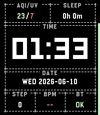

# Textface

An opinionated, TUI-styled watchface for Pebble. Time, date, and the data you
care about, framed in dashed terminal-style windows — text over icons,
contrast over decoration, utility over hand-holding.



Built for the modern Pebble lineup; currently targets **emery**
(Pebble Time 2).

## Features

- **Big, legible time** in the system LECO font, with your choice of ISO-style
  date formats (`TUE 2026-06-09`, `2026-06-09 TUE`, or `TUE JUNE 9th, 2026`).
- **Five complication slots** (two wide on top, three below) you can fill
  from: weather (condition + temperature), steps, sleep, heart rate, active
  minutes, Bluetooth status, air quality (US AQI), UV index (the peak over
  the next 12 hours — what's coming, not what already happened), or a
  combined AQI/UV view — or leave empty.
- **Edge progress bars**: the left screen edge fills as you approach your
  daily step goal; the right edge shows battery level. These are fixed by
  design.
- **Day/Night themes** with automatic switching (day from 06:00, night from
  18:00), or pin either one. Both palettes are high contrast.
- **Color-coded values**: battery, temperature, AQI, and UV shift
  green/yellow/red (or blue for cold) as conditions change.
- **Weather without an API key** — data comes from
  [Open-Meteo](https://open-meteo.com) via your phone's location, refreshed
  every 30 minutes.

## Configuration

Open the watchface settings in the Pebble mobile app. Settings are
deliberately few:

| Setting | Options |
|---------|---------|
| Theme | Auto (day/night), Day, Night |
| Units | Imperial, Metric |
| Date format | Weekday + ISO, ISO + Weekday, full text |
| Slots 1–5 | Data source per slot, or Empty |

That's the whole surface. Textface favors good defaults over knobs; if a
behavior isn't configurable, that's a decision, not an oversight.

## Philosophy

Textface doesn't try to please everyone. It has a point of view:

- **TUI-like, but legible.** The terminal aesthetic serves readability on a
  small e-paper-style screen; where the two conflict, legibility wins.
- **High-contrast themes.** Both the day and night palettes keep text sharply
  readable; muted, low-contrast color schemes are out of scope.
- **Curated complications.** Ever scrolled a settings page with a hundred
  complications trying to find the three you actually care about? Textface
  adds data sources deliberately and selectively. You are welcome to propose
  things — however, I'm unlikely to implement them *for you*. I might
  implement them for *me*, if that makes any sense. Forking is always an
  option! (See [CONTRIBUTING.md](CONTRIBUTING.md).)
- **Utility first.** When usefulness and approachability pull in different
  directions, Textface picks useful.
- **Minimal configuration.** Every setting has to earn its place.
- **Fork-friendly.** Textface can afford to be this opinionated *because*
  forking is cheap and encouraged. If your three essential complications
  aren't my three, don't settle — fork it and make it yours.
  [CONTRIBUTING.md](CONTRIBUTING.md) has notes to get you started.

## A note on scope

I build watchfaces for other people at work. Textface is the one I build for
me — so I'm keeping it that way. I'm happy to take bug fixes and well-scoped
PRs, but I'm unlikely to implement someone else's feature idea *for* them;
turning requests into a backlog is the part of work I'm deliberately not
recreating here. If there's something you want that I won't build, that's
genuinely what forking is for — and I'd love to see what you make.

## Building from source

Requires the [Pebble SDK](https://developer.repebble.com). The CLI is set up
in a project-local virtualenv:

```sh
source pebble-env/bin/activate
pebble build                          # build for all targetPlatforms
pebble install --emulator emery       # run on the emery emulator
pebble install --phone <ip>           # install to a paired phone
```

Run the unit tests (host-only, no SDK needed):

```sh
cd test && make test
```

## Development

- [CONTRIBUTING.md](CONTRIBUTING.md) — how to contribute or fork, and what
  gets accepted
- [AGENTS.md](AGENTS.md) — project values, conventions, and hard rules for
  contributors and AI agents
- [docs/ARCHITECTURE.md](docs/ARCHITECTURE.md) — how it all works: data flow,
  modules, the complication system, theming, testing
- [docs/SIDEBARS.md](docs/SIDEBARS.md) — why the edge bars are fixed
- [ISSUES.md](ISSUES.md) — known bugs · [TODOs.md](TODOs.md) — planned ideas

Full SDK docs, tutorials, and API reference: <https://developer.repebble.com>

## AI disclosure

Textface was developed with extensive assistance from AI coding agents —
Google's **Gemini** and Anthropic's **Claude** — under human direction and
review. This includes code, tests, and documentation.

If you'd rather not use a watchface built with this much AI involvement,
that's completely fair — no hard feelings.

## License

This project is licensed under the
[PolyForm Noncommercial License 1.0.0](LICENSE.md). In short: you may fork it,
modify it, and redistribute your own versions freely — for any **noncommercial**
purpose. Selling this watchface or a derivative of it is not permitted.

If you make improvements, contributing them back upstream via a pull request
is warmly appreciated (though not required).

Weather, UV, and air-quality data is provided by
[Open-Meteo.com](https://open-meteo.com/) (CC BY 4.0, free for non-commercial
use). See [docs/LICENSES.md](docs/LICENSES.md) for a full audit of upstream
dependency licenses.
